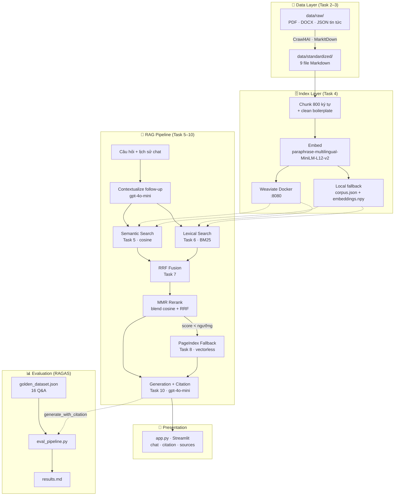
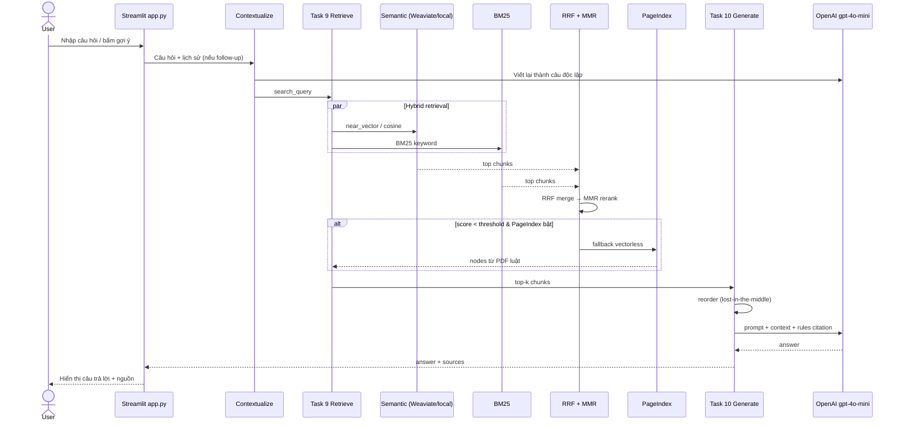
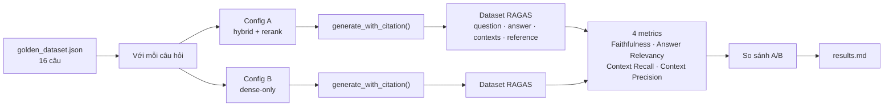

# Bài Tập Nhóm — Search Engine / RAG Chatbot

## Mục Tiêu

Sau khi hoàn thành bài cá nhân, nhóm ngồi lại để xây dựng **1 trong 2 sản phẩm**:

---

## Yêu cầu 1:  Sản phẩm nhóm RAG Chatbot

Xây dựng chatbot trả lời câu hỏi về pháp luật ma tuý và tin tức liên quan.

**Yêu cầu:**
- Giao diện chat (Streamlit / Gradio / Chainlit)
- Trả lời có citation (dựa trên Task 10)
- Hỗ trợ follow-up questions (conversation memory)
- Hiển thị source documents đã dùng

**Stack gợi ý:**
```
Chainlit/Streamlit → Retrieval (Task 9) → Generation (Task 10) → Display
```

---

## Yêu cầu 2: RAG Evaluation Pipeline

Sử dụng **1 trong 3 framework** sau để evaluate pipeline RAG của nhóm:

### Framework lựa chọn

| Framework | Cài đặt | Đặc điểm |
|-----------|---------|-----------|
| [DeepEval](https://github.com/confident-ai/deepeval) | `pip install deepeval` | Nhiều metric built-in, dễ integrate với pytest |
| [RAGAS](https://github.com/explodinggradients/ragas) | `pip install ragas` | Chuẩn industry cho RAG eval, 3 trục chính |
| [TruLens](https://github.com/truera/trulens) | `pip install trulens` | Dashboard UI, feedback functions mạnh |

### Yêu cầu Evaluation

1. **Tạo Golden Dataset** — tối thiểu 15 cặp Q&A (question, expected_answer, expected_context)
2. **Chạy evaluation** trên toàn bộ golden dataset với các metrics sau:
   - **Faithfulness** — câu trả lời có bám đúng context không?
   - **Answer Relevance** — câu trả lời có đúng câu hỏi không?
   - **Context Recall** — retriever có lấy đủ evidence không?
   - **Context Precision** — trong context lấy về, bao nhiêu % thực sự hữu ích?
3. **So sánh A/B** — chạy eval trên ít nhất 2 config khác nhau (ví dụ: có reranking vs không reranking, hoặc hybrid vs dense-only)
4. **Báo cáo** — bảng điểm + phân tích worst performers + đề xuất cải tiến

### Code mẫu — DeepEval

```python
from deepeval import evaluate
from deepeval.metrics import (
    FaithfulnessMetric,
    AnswerRelevancyMetric,
    ContextualRecallMetric,
    ContextualPrecisionMetric,
)
from deepeval.test_case import LLMTestCase

# Tạo test cases từ golden dataset
test_cases = []
for item in golden_dataset:
    result = rag_pipeline.generate_with_citation(item["question"])
    test_case = LLMTestCase(
        input=item["question"],
        actual_output=result["answer"],
        expected_output=item["expected_answer"],
        retrieval_context=[c["content"] for c in result["sources"]],
    )
    test_cases.append(test_case)

# Chạy evaluation
metrics = [
    FaithfulnessMetric(threshold=0.7),
    AnswerRelevancyMetric(threshold=0.7),
    ContextualRecallMetric(threshold=0.7),
    ContextualPrecisionMetric(threshold=0.7),
]

results = evaluate(test_cases, metrics)
```

### Code mẫu — RAGAS

```python
from ragas import evaluate
from ragas.metrics import (
    faithfulness,
    answer_relevancy,
    context_recall,
    context_precision,
)
from datasets import Dataset

# Chuẩn bị data
eval_data = {
    "question": [],
    "answer": [],
    "contexts": [],
    "ground_truth": [],
}

for item in golden_dataset:
    result = rag_pipeline.generate_with_citation(item["question"])
    eval_data["question"].append(item["question"])
    eval_data["answer"].append(result["answer"])
    eval_data["contexts"].append([c["content"] for c in result["sources"]])
    eval_data["ground_truth"].append(item["expected_answer"])

dataset = Dataset.from_dict(eval_data)

# Chạy evaluation
result = evaluate(
    dataset,
    metrics=[faithfulness, answer_relevancy, context_recall, context_precision],
)
print(result.to_pandas())
```

### Code mẫu — TruLens

```python
from trulens.apps.custom import TruCustomApp, instrument
from trulens.core import Feedback
from trulens.providers.openai import OpenAI as TruOpenAI

provider = TruOpenAI()

# Define feedback functions
f_faithfulness = Feedback(provider.groundedness_measure_with_cot_reasons).on_output()
f_relevance = Feedback(provider.relevance).on_input_output()
f_context_relevance = Feedback(provider.context_relevance).on_input()

# Wrap RAG pipeline
tru_rag = TruCustomApp(
    rag_pipeline,
    app_name="DrugLaw_RAG",
    feedbacks=[f_faithfulness, f_relevance, f_context_relevance],
)

# Run evaluation
with tru_rag as recording:
    for item in golden_dataset:
        rag_pipeline.generate_with_citation(item["question"])

# View dashboard
from trulens.dashboard import run_dashboard
run_dashboard()
```

### Deliverable Evaluation

- [ ] File `group_project/evaluation/golden_dataset.json` — 15+ cặp Q&A
- [ ] File `group_project/evaluation/eval_pipeline.py` — script chạy evaluation
- [ ] File `group_project/evaluation/results.md` — bảng điểm + phân tích
- [ ] So sánh A/B ít nhất 2 configs

---

## Yêu Cầu Chung

1. **Tích hợp pipeline** từ bài cá nhân của các thành viên
2. **Demo hoạt động được** trong buổi trình bày (chạy local hoặc deploy)
3. **Evaluation pipeline** chạy được và có báo cáo kết quả
4. **Code push lên repository** chung của nhóm
5. **README** mô tả kiến trúc và phân công (điền bên dưới)

---

## Sản phẩm đã xây dựng

Nhóm thực hiện **cả hai** yêu cầu:

1. **RAG Chatbot** (Streamlit) — `app.py` ở thư mục gốc.
2. **RAG Evaluation Pipeline** (RAGAS) — `group_project/evaluation/`.

---

## Kiến Trúc Hệ Thống

Hệ thống gồm **3 luồng chính**: (1) chuẩn bị dữ liệu & index, (2) RAG chatbot, (3) evaluation.

### Sơ đồ tổng quan



### Luồng xử lý 1 câu hỏi (Chatbot)



### Luồng Evaluation (A/B)



### Các tầng & module

| Tầng | Thành phần | File / công nghệ |
|------|------------|------------------|
| **Data** | Thu thập & chuẩn hóa | `task2_crawl_news.py`, `task3_convert_markdown.py` |
| **Index** | Chunk · embed · lưu trữ | `task4_chunking_indexing.py`, Weaviate, `data/index/` |
| **Retrieval** | Dense + sparse + fusion | `task5_semantic_search.py`, `task6_lexical_search.py`, `task7_reranking.py`, `task9_retrieval_pipeline.py` |
| **Vectorless** | Fallback cấu trúc PDF | `task8_pageindex_vectorless.py` |
| **Generation** | Sinh câu trả lời + citation | `task10_generation.py`, OpenAI `gpt-4o-mini` |
| **UI** | Chatbot demo | `app.py`, Streamlit |
| **Evaluation** | Chấm chất lượng RAG | `eval_pipeline.py`, RAGAS, `golden_dataset.json`, `results.md` |

### Corpus hiện tại (9 tài liệu → 964 chunks)

| Loại | Tài liệu |
|------|----------|
| Pháp luật | NĐ 28/2026 (danh mục chất ma túy), BLHS sửa đổi 2017, NĐ 105/2021, TTLT 17/2015 |
| Tin tức | Tuổi Trẻ, VietnamNet — vụ nghệ sĩ liên quan ma túy (Chi Dân, An Tây, Lệ Hằng, …) |

---

## Phân Công Công Việc

> Chỉ phân công **bài tập nhóm** (30% + bonus). Bài cá nhân (Task 1–10) mỗi thành viên tự hoàn thành riêng.

| Thành viên | MSSV | Nhiệm vụ (bài nhóm) | Deliverable | Trạng thái |
|-----------|------|---------------------|-------------|------------|
|Phan Võ Trọng Tiển| 2A202600781 | **Tích hợp pipeline RAG** — kết nối retrieval (Task 9) + generation (Task 10); cấu hình `retrieve_kwargs`, follow-up memory | `src/task9_retrieval_pipeline.py`, `src/task10_generation.py` | ✅ |
|Phan Võ Trọng Tiển |2A202600781 | **RAG Chatbot (Streamlit)** — giao diện chat, citation, hiển thị nguồn, gợi ý câu hỏi, sidebar cấu hình | `app.py` | ✅ |
|Đào Văn Tuân |2A202600609 | **Golden dataset** — soạn ≥15 cặp Q&A grounded vào corpus (pháp luật + tin tức) | `evaluation/golden_dataset.json` | ✅ |
|Võ Tấn Trung |2A202600642 | **Evaluation pipeline (RAGAS)** — chạy 4 metrics, so sánh A/B 2 config, xuất báo cáo | `evaluation/eval_pipeline.py`, `evaluation/results.md` | ✅ |
|Nguyễn Bá Thành |2A202600675 | **Kiến trúc & tài liệu nhóm** — sơ đồ hệ thống (Mermaid), hướng dẫn chạy, phân công | `group_project/README.md` | ✅ |


---

## Hướng Dẫn Chạy

```bash
# 1. Cài đặt dependencies
pip install -r requirements.txt
python -m playwright install chromium      # cho crawling (Task 2)
pip install ragas datasets                 # cho evaluation

# 2. (Khuyến nghị) Bật Weaviate bằng Docker — không bắt buộc, có local fallback
docker compose up -d

# 3. Tạo .env với OPENAI_API_KEY (và PAGEINDEX_API_KEY nếu dùng fallback)

# 4. Build index (nếu chưa có data/index/)
python -m src.task4_chunking_indexing

# 5a. Chạy Chatbot
streamlit run app.py

# 5b. Hoặc chạy Evaluation (RAGAS, dùng OpenAI để chấm)
python -m group_project.evaluation.eval_pipeline
# → kết quả ghi vào group_project/evaluation/results.md
```

### Tính năng Chatbot (`app.py`)
- Giao diện chat Streamlit, lưu **lịch sử hội thoại** (hỗ trợ follow-up — câu hỏi
  được viết lại thành câu độc lập dựa trên ngữ cảnh trước khi retrieval).
- Câu trả lời **có trích dẫn** và panel **hiển thị nguồn** (tên tài liệu, loại,
  score, nguồn retrieval).
- Sidebar cấu hình: `top_k`, chế độ `hybrid/dense`, bật/tắt reranking & PageIndex.

---

## Lưu ý: Hãy giữ lại repo này nếu như bạn học track 3 giai đoạn 2, chúng ta sẽ phát triển tiếp dự án lên knowledge graph để khắc phục các câu hỏi hóc búa khi có các câu hỏi khó.
